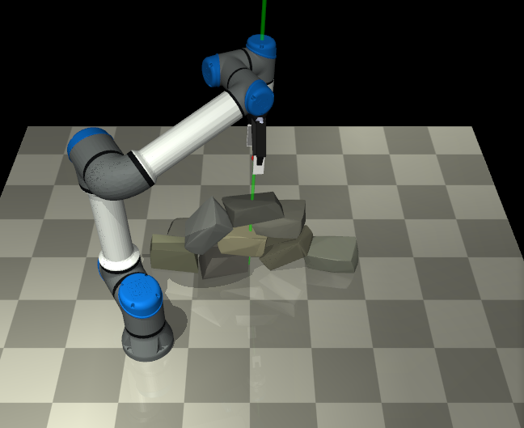

# MuJoCo Robotic Dry-Stone Stacking

MuJoCo research prototype for robotic dry-stone wall construction with
irregular natural stones. The current implementation combines procedural stone
generation, stability-based sequence planning, and contact-rich manipulation by
an articulated UR5e arm with a Robotiq 2F-140 gripper.

The project is intended as a reproducible simulation baseline for studying how
a robot can select, grasp, transport, and place irregular stones without mortar.
It is not a rendering-only animation: stone transport uses MuJoCo contact and
friction at the gripper pads, and each placed stone is released and settled
under gravity.



## Scope

This repository implements a truth-state simulation pipeline for dry-stone
stacking:

```text
procedural irregular stone generation
-> stability-aware wall sequence planning
-> next-best object and target-pose selection
-> UR5e + Robotiq contact grasping in MuJoCo
-> release, settling, and success evaluation
```

The current verified demo builds a `4 + 3 + 2 + 1` dry-stone wall using ten
selected stones from a larger generated candidate set. The smaller `3 + 2 + 1`
configuration is still useful as a fast smoke test, but the main reported
baseline is now the ten-stone, four-course execution.

## Research Basis

The implementation follows ideas from three related lines of work:

- **From Rocks to Walls: A Model-free Reinforcement Learning Approach to Dry
  Stacking with Irregular Rocks**
  - Used here for procedural irregular rock generation.
  - The DQN policy is intentionally not reproduced in this project.

- **Autonomous Robotic Stone Stacking with Online Next Best Object Target Pose
  Planning**
  - Used here for the truth-state next-best object and target-pose planning
    structure.
  - Camera perception, point-cloud pose estimation, MoveIt, and the original
    UR10 hardware system are outside the current implementation.

- **Stability-Based Sequence Planning for Robotic Dry-Stacking of Natural
  Stones**
  - Used here for stability-aware sequence selection: candidate stones and
    target poses are evaluated with support, contact, geometric error, and
    disturbance-survival criteria before execution.

PDFs are intentionally ignored by Git. Keep papers locally if needed, but do
not commit copyrighted full papers to a public repository.

## Current Capabilities

Implemented:

- Procedural irregular stones using subdivision, truncated-normal vertex
  displacement, convex hull reconstruction, OBB alignment, and randomized
  density.
- Paper-style visual stone meshes for the verified execution demo. The
  original convex meshes still provide contact, mass, friction, and stability;
  the outer visual meshes use smooth normals, colored material styling, and a
  deterministic visual grain layer so the viewer shows fine stone-like surface
  granularity.
- Stability-based course planning for `3,2,1` smoke tests and `4,3,2,1`
  four-course walls.
- Truth-state object and target-pose search in MuJoCo.
- Gravity, contact, friction, release, and settling simulation.
- Articulated UR5e execution using MuJoCo Jacobian IK.
- Robotiq 2F-140 contact grasping with actuated finger joints.
- No weld or attach constraint between the gripper and stones during transport.
- Vertical gripper retreat after release, so the gripper lifts away from the
  placed stone instead of sliding horizontally through the wall.
- Rear supply-pocket reset before each grasp, keeping unplaced stones away from
  the wall during manipulation.
- Grasp retry support for difficult stones.
- Experimental rough-stackable stone style with stronger side relief and
  flatter bedding faces for more natural-looking generated rocks.
- Execution-aware planning filters for Robotiq graspability, including maximum
  candidate width and manual exclusion after failed robot trials.
- Optional placement yaw overrides and light contact-settling travel for
  diagnosing release-sensitive upper-course stones.
- Clean UR5e visualization that preserves robosuite assembled visual meshes and
  hides only robot collision geoms.

Not implemented yet:

- RGB-D perception, segmentation, ICP, or online pose estimation.
- Full collision-free motion planning with OMPL/MoveIt-style planning.
- Force/torque-triggered placement control.
- Real scanned stone meshes and measured inertial parameters.
- Reinforcement learning policy training.

## Installation

Python 3.10 or 3.11 is recommended.

```bash
cd /home/xunden/stone-stacking-mujoco
python3.10 -m venv .venv
source .venv/bin/activate
python -m pip install --upgrade pip
python -m pip install -r requirements.txt
```

Check MuJoCo:

```bash
python -c "import mujoco; print(mujoco.__version__)"
```

## Robot Assets

The execution layer currently uses local robosuite MJCF assets:

```text
robots/ur5e/robot.xml
grippers/robotiq_gripper_140.xml
```

In the current development machine these assets are loaded from:

```text
/home/xunden/isaac-sim/kit/python/lib/python3.11/site-packages/robosuite/models/assets
```

If you run this repository on another machine, install robosuite assets or
update the asset paths in:

```text
scripts/run_official_ur5e_robotiq_grasp_test.py
```

## Quick Start

The shortest way to open the verified ten-stone demo is:

```bash
cd /home/xunden/stone-stacking-mujoco
./scripts/run_verified_paper_wall_demo.sh --view
```

This wrapper exists to avoid shell line-continuation mistakes in the long
command below.

Generate the verified ten-stone, four-course wall plan:

```bash
cd /home/xunden/stone-stacking-mujoco
source .venv/bin/activate
python scripts/run_stability_sequence_planner.py \
  --rock-style paper \
  --stones 24 \
  --courses 4,3,2,1 \
  --samples-per-stone 16 \
  --max-grasp-mass 2.80 \
  --min-support-bodies 1 \
  --output-json reports/stability_sequence_planner_4_3_2_1_paper_light_24_s16_m28.json \
  --save-final-xml outputs/stability_sequence_planner_4_3_2_1_paper_light_24_s16_m28.xml
```

This writes:

```text
reports/stability_sequence_planner_4_3_2_1_paper_light_24_s16_m28.json
outputs/stability_sequence_planner_4_3_2_1_paper_light_24_s16_m28.xml
```

Run the UR5e + Robotiq execution demo:

```bash
python scripts/run_official_ur5e_robotiq_wall_stack.py \
  --report reports/stability_sequence_planner_4_3_2_1_paper_light_24_s16_m28.json \
  --max-placements 10 \
  --close 0.30 \
  --grasp-retries 1 \
  --grasp-retry-close-step 0.06 \
  --upper-place-clearance 0.000 \
  --upper-place-descent-time 1.50 \
  --contact-aware-place \
  --settle-time 1.20 \
  --robot-visual clean \
  --stone-visual-style paper \
  --stone-visual-roughness 0.0025 \
  --stone-visual-subdivisions 2 \
  --stone-grain-strength 0.38 \
  --stone-grain-particles 140 \
  --view
```

The MuJoCo viewer will show the robot grasping, transporting, releasing, and
vertically retreating from ten irregular stones in a `4 + 3 + 2 + 1`
dry-stone wall.

The `--stone-visual-*` parameters only change rendering. They do not change the
collision mesh used for grasping and stacking. The default `paper` visual style
uses smooth normals and saturated per-stone colors, matching the reference
figures more closely than a noisy gray rock material. The `--stone-grain-*`
parameters add small visual-only dark and light speckles on the stone surface
to express granular roughness. Use `--stone-grain-strength 0.55` and
`--stone-grain-particles 200` for stronger visual grain, or
`--stone-grain-particles 0` for smooth color-only stones. The separate
`--stone-grain-texture` flag enables an experimental 2D texture path, but it is
not the default because simple mesh UVs can stretch on side faces.

## Headless Verification

Run the same execution without opening the viewer:

```bash
python scripts/run_official_ur5e_robotiq_wall_stack.py \
  --report reports/stability_sequence_planner_4_3_2_1_paper_light_24_s16_m28.json \
  --max-placements 10 \
  --close 0.30 \
  --grasp-retries 1 \
  --grasp-retry-close-step 0.06 \
  --upper-place-clearance 0.000 \
  --upper-place-descent-time 1.50 \
  --contact-aware-place \
  --settle-time 1.20 \
  --robot-visual clean \
  --stone-visual-style paper \
  --stone-visual-roughness 0.0025 \
  --stone-visual-subdivisions 2 \
  --stone-grain-strength 0.38 \
  --stone-grain-particles 140 \
  --save-xml outputs/official_ur5e_robotiq_paper_light_4_3_2_1_10.xml \
  --output-json reports/official_ur5e_robotiq_paper_light_4_3_2_1_10.json
```

Verified result on the current development setup:

```text
success: true
requested_placements: 10
placed_count: 10
stacked_count: 9
final_center_height_m: 0.23883726347722897
```

The corresponding placement trace is:

```text
placement=1 stone=rock_wall_20 course=0 lifted=0.131 placed=True
placement=2 stone=rock_wall_24 course=0 lifted=0.111 placed=True
placement=3 stone=rock_wall_22 course=0 lifted=0.105 placed=True
placement=4 stone=rock_wall_07 course=0 lifted=0.082 placed=True
placement=5 stone=rock_wall_06 course=1 lifted=0.127 placed=True
placement=6 stone=rock_wall_09 course=1 lifted=0.099 placed=True
placement=7 stone=rock_wall_14 course=1 lifted=0.079 placed=True
placement=8 stone=rock_wall_02 course=2 lifted=0.129 placed=True
placement=9 stone=rock_wall_01 course=2 lifted=0.104 placed=True
placement=10 stone=rock_wall_21 course=3 lifted=0.121 placed=True
```

## Rough-Stone Experimental Branch

The `rough` stone style is intended to move the generated stones away from
box-like convex blocks while keeping them plausible for dry stacking. Compared
with the verified `paper` baseline, it adds stronger side relief and visible
faceting but keeps the top and bottom bedding directions flatter than the
`natural` stress-test style.

Generate a rough 10-stone candidate wall with execution-aware filters:

```bash
python scripts/run_stability_sequence_planner.py \
  --rock-style rough \
  --stones 48 \
  --courses 4,3,2,1 \
  --samples-per-stone 24 \
  --max-grasp-mass 2.80 \
  --max-grasp-width 0.125 \
  --min-support-bodies 1 \
  --lower-course-supports-only \
  --support-count-weight 5.0 \
  --area-weight 0.040 \
  --min-support-area 0.002 \
  --output-json reports/stability_sequence_planner_4_3_2_1_rough_bedded_graspable_48_s24_m28_w125_a002.json \
  --save-final-xml outputs/stability_sequence_planner_4_3_2_1_rough_bedded_graspable_48_s24_m28_w125_a002.xml
```

The current rough planner can produce complete `4 + 3 + 2 + 1` reports. Robot
execution is still experimental: the best full rough-wall runs currently place
most stones but do not yet produce a verified 10/10 stable wall. A focused
five-placement test with a placement-5 yaw override is successful:

```bash
python scripts/run_official_ur5e_robotiq_wall_stack.py \
  --report reports/stability_sequence_planner_4_3_2_1_rough_bedded_graspable_48_s24_m28_w125_a002.json \
  --max-placements 5 \
  --close 0.30 \
  --grasp-retries 2 \
  --grasp-retry-close-step 0.04 \
  --grasp-yaw-overrides 5:1.57079632679 \
  --upper-place-clearance -0.020 \
  --upper-place-descent-time 1.65 \
  --contact-aware-place \
  --place-contact-settle-depth 0.006 \
  --settle-time 1.20 \
  --online-support-correction \
  --support-correction-gain 0.80 \
  --max-support-correction 0.050 \
  --robot-visual clean
```

Verified rough-branch diagnostic result on the current development setup:

```text
success: true
requested_placements: 5
placed_count: 5
stacked_count: 5
```

The current bottleneck is not grasp lifting: the UR5e and Robotiq can lift the
rough stones. The limiting failure mode is upper-course release sensitivity:
some rough stones slide along the support surface after the gripper opens. The
next research step is to make the planner score robot-executable release
robustness directly, instead of only scoring the settled object pose.

## Important Execution Parameters

The verified ten-stone execution uses:

```text
Robotiq close command: 0.30 rad
grasp retries: 1
grasp retry close step: 0.06 rad
bottom-course place clearance: 0.010 m
upper-course place clearance: 0.000 m
upper-course descent time: 1.50 s
settle time after release: 1.20 s
retreat after release: vertical lift
```

These parameters were tuned to reduce three common failure modes:

- excessive lateral squeezing of sloped irregular stones by the gripper;
- top-course stones settling too low after release;
- the gripper brushing the wall during post-release retreat.

If these parameters are changed, rerun the headless verification before using
the result as a baseline.

## Stone Geometry

The verified demo uses the `paper` rock style from
`stone_stack/rock_wall_stones.py`. This is not a box primitive: each stone is
generated from a rectangular prism by subdivision, truncated-normal vertex
displacement, convex hull reconstruction, and oriented-bounding-box alignment.
The resulting convex surface participates in MuJoCo contact. For the verified
viewer demo, an additional massless, collision-disabled visual mesh provides
the paper-style appearance: smooth shading, colored stone materials, light
millimeter-scale relief, and a visual-only granular speckle layer. This changes
how the stones look in the viewer without changing the already validated
grasping and stacking dynamics.

The `natural` style is also available:

```bash
python scripts/run_stability_sequence_planner.py --rock-style natural
```

It produces stronger visual roughness and less planar bedding surfaces. That is
useful for stress-testing planning, but the current robust robot-execution
baseline uses the `paper` style because its rough convex stones remain
stackable under gripper release.

## Rendering the Result

Generate the README snapshot from the final execution report:

```bash
python scripts/render_wall_stack_snapshot.py \
  --xml outputs/official_ur5e_robotiq_paper_light_4_3_2_1_10.xml \
  --report reports/official_ur5e_robotiq_paper_light_4_3_2_1_10.json \
  --output docs/assets/official_ur5e_wall_snapshot.png \
  --distance 1.12 \
  --azimuth 118 \
  --elevation -24
```

The execution XML contains the initial simulation scene, while the final stone
poses are stored in the JSON report. The renderer therefore restores every
stone from `final_pos` and `final_quat` before rendering the final wall.

## Repository Structure

```text
stone_stack/
  rock_wall_stones.py       procedural irregular stone generation
  rocks.py                  stone geometry utilities
  paper_scene.py            MuJoCo scene construction utilities

scripts/
  run_stability_sequence_planner.py
      stability-based wall sequence planner

  run_official_ur5e_robotiq_wall_stack.py
      main UR5e + Robotiq wall execution script

  run_official_ur5e_robotiq_grasp_test.py
      single-stone Robotiq contact-grasp test and shared robot utilities

  render_wall_stack_snapshot.py
      final-wall still-image renderer

docs/
  implementation notes and README assets
```

## Design Notes

The simulation currently assumes truth-state access to:

- stone meshes;
- stone poses;
- candidate target poses;
- final post-settling states.

This is deliberate. The present goal is to isolate the mechanics of planning,
grasping, transporting, releasing, and stabilizing irregular stones before
adding perception. The next natural research steps are:

- point-cloud segmentation and pose estimation for unstructured stone piles;
- grasp-candidate generation over irregular convex meshes;
- force/contact-triggered placement termination;
- collision-aware arm motion planning;
- real scanned stone meshes and measured inertial parameters;
- sim-to-real validation with a physical UR arm and Robotiq gripper.

## Generated Files

The repository ignores generated artifacts by default:

```text
.venv/
logs/
reports/
outputs/
*.mp4
*.mjb
*.pdf
```

This keeps the Git history focused on source code and documentation. Run the
scripts above to regenerate reports, MuJoCo XML scenes, rendered images, and
videos locally.
