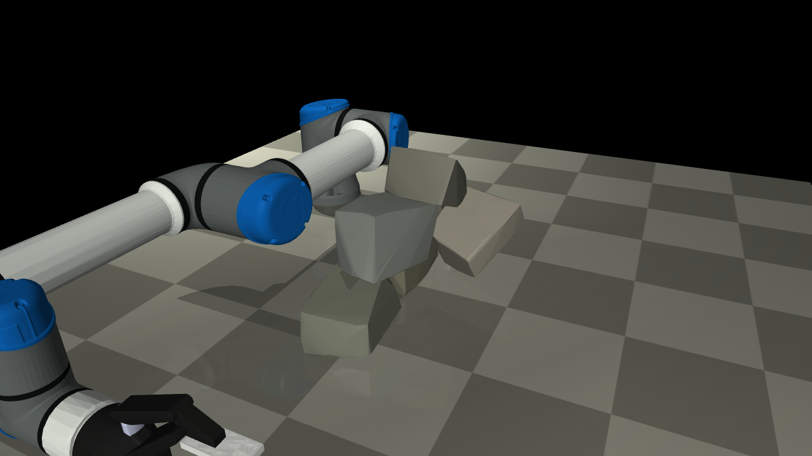

# MuJoCo Robotic Dry-Stone Stacking

这是一个用于机械臂抓取天然石块并干叠成墙的 MuJoCo 复现实验项目。当前目标不是做展示动画，而是在仿真里建立一条可运行、可验证、可继续扩展的复现路线：

```text
From Rocks to Walls 风格石头生成
-> Stability-Based Sequence Planning 风格稳定性序列规划
-> ICRA 2017 风格真值 next-best object / target-pose 搜索
-> UR5e + Robotiq 2F-140 在 MuJoCo 中接触抓取、搬运、释放、沉降
```

当前主 demo 已经可以在 MuJoCo viewer 中看到 UR5e 机械臂使用 Robotiq 夹爪逐块抓取 6 块不规则石头，并堆成 `3 + 2 + 1` 的干叠小墙。石头不是 weld 到夹爪上的，搬运阶段依靠 Robotiq 指尖/指腹碰撞几何和摩擦接触。



## 当前状态

已实现：

- From Rocks to Walls 风格的程序化天然石块生成：长方体种子、网格细分、截断正态顶点扰动、凸包、OBB 对齐、随机密度。
- 稳定性序列规划：按层选择石头顺序，使用支撑面积、接触数量、目标误差、法向偏差、扰动测试等指标筛选候选。
- ICRA 2017 风格的真值规划框架：已知石头几何和姿态，在线选择下一块石头和目标位姿。
- MuJoCo 接触仿真：重力、碰撞、摩擦、释放后沉降都在物理引擎里发生。
- UR5e + Robotiq 2F-140 执行层：使用 robosuite MJCF 模型、MuJoCo Jacobian IK、Robotiq 位置执行器和真实接触抓取。
- 6 块石头 `3 + 2 + 1` 墙体执行 demo，当前默认参数验证通过。

还没有实现：

- RGB-D 感知、点云分割、ICP 或实际石头姿态估计。
- MoveIt / OMPL 级别的完整无碰撞运动规划。
- 力控放置或力矩传感器反馈。
- 真实扫描石头数据集。
- From Rocks to Walls 的 DQN 训练。当前路线明确不做 DQN，而是用其石头生成方法。

当前是一个可运行的研究原型，不是论文的一比一硬件复现。它适合继续扩展到更真实的感知、抓取候选生成、力控放置和真实石头 mesh。

## 参考论文

本项目主要参考三条路线：

- `From Rocks to Walls: A Model-free Reinforcement Learning Approach to Dry Stacking with Irregular Rocks`
  - 当前只采用其中的程序化不规则石头生成思路。
  - 不复现 DQN。

- `Autonomous Robotic Stone Stacking with Online Next Best Object Target Pose Planning`
  - 当前采用其 truth-state next-best object / target-pose 搜索结构。
  - 当前不包含 RGB-D 感知、UR10 实机系统和 MoveIt。

- `Stability-Based Sequence Planning for Robotic Dry-Stacking of Natural Stones`
  - 当前采用稳定性序列规划思想：候选石头和候选位姿先经过支撑/接触/扰动稳定性评估，再提交到执行层。

论文 PDF 建议本地保存阅读，不建议直接上传公开 GitHub 仓库；本仓库默认通过 `.gitignore` 忽略 `*.pdf`。

## 环境要求

推荐 Python 3.10 或 3.11。

```bash
cd /home/xunden/stone-stacking-mujoco
python3.10 -m venv .venv
source .venv/bin/activate
python -m pip install --upgrade pip
python -m pip install -r requirements.txt
```

验证 MuJoCo：

```bash
python -c "import mujoco; print(mujoco.__version__)"
```

当前 UR5e 和 Robotiq 模型来自本机 robosuite 资源路径：

```text
/home/xunden/isaac-sim/kit/python/lib/python3.11/site-packages/robosuite/models/assets/robots/ur5e/robot.xml
/home/xunden/isaac-sim/kit/python/lib/python3.11/site-packages/robosuite/models/assets/grippers/robotiq_gripper_140.xml
```

如果在别的机器上运行，需要安装 robosuite 资产，或者把 `scripts/run_official_ur5e_robotiq_grasp_test.py` 里的资产路径改成对应机器上的路径。

## 快速运行最终 demo

运行下面命令会打开 MuJoCo viewer。可以看到机械臂抓取 6 块石头并堆成 `3 + 2 + 1` 小墙：

```bash
cd /home/xunden/stone-stacking-mujoco
source .venv/bin/activate
python scripts/run_official_ur5e_robotiq_wall_stack.py \
  --report reports/stability_sequence_planner.json \
  --max-placements 6 \
  --robot-visual clean \
  --view
```

当前默认执行参数已经调好：

```text
Robotiq close command: 0.32
bottom-course place clearance: 0.010 m
upper-course place clearance: -0.045 m
robot visual: clean
```

不要再传旧的：

```bash
--upper-place-clearance -0.035
```

旧参数容易让顶层石头落低。当前默认 `-0.045` 已验证更稳。

## 重新生成规划结果

先运行稳定性序列规划：

```bash
cd /home/xunden/stone-stacking-mujoco
source .venv/bin/activate
python scripts/run_stability_sequence_planner.py
```

默认输出：

```text
reports/stability_sequence_planner.json
outputs/stability_sequence_planner_final.xml
```

默认规划参数：

```text
stone_seed: 17
stones: 7
courses: 3,2,1
rock_irregularity: 1.0
rock_subdivisions: 5
max_grasp_mass: 3.20 kg
```

当前默认规划层会生成 7 块候选石头，从中选择 6 块组成 `3 + 2 + 1` 墙体。然后执行层读取该报告，让 UR5e + Robotiq 逐块抓取、搬运、释放。

## Headless 验证

不打开 viewer，直接跑最终执行验证：

```bash
cd /home/xunden/stone-stacking-mujoco
source .venv/bin/activate
python scripts/run_official_ur5e_robotiq_wall_stack.py \
  --report reports/stability_sequence_planner.json \
  --max-placements 6 \
  --robot-visual clean \
  --save-xml outputs/official_ur5e_robotiq_default_safe_queue_6.xml \
  --output-json reports/official_ur5e_robotiq_default_safe_queue_6.json
```

当前已验证输出：

```text
placement=1 stone=rock_wall_06 course=0 lifted=0.092 placed=True
placement=2 stone=rock_wall_04 course=0 lifted=0.102 placed=True
placement=3 stone=rock_wall_07 course=0 lifted=0.069 placed=True
placement=4 stone=rock_wall_03 course=1 lifted=0.112 placed=True
placement=5 stone=rock_wall_02 course=1 lifted=0.127 placed=True
placement=6 stone=rock_wall_01 course=2 lifted=0.114 placed=True

success: true
placed_count: 6
stacked_count: 6
final_center_height_m: 0.18965227759944397
```

## 渲染结果图片

运行下面命令可以从最终执行报告渲染一张 README 使用的静态图：

```bash
cd /home/xunden/stone-stacking-mujoco
source .venv/bin/activate
python scripts/render_wall_stack_snapshot.py \
  --xml outputs/official_ur5e_robotiq_default_safe_queue_6.xml \
  --report reports/official_ur5e_robotiq_default_safe_queue_6.json \
  --output docs/assets/official_ur5e_wall_snapshot.png
```

注意：执行层的 XML 是初始仿真场景，最终石头姿态在 JSON 报告里。因此渲染脚本会读取 JSON 中每块石头的 `final_pos` 和 `final_quat`，再更新 MuJoCo `freejoint` 后渲染。

## 关键脚本

```text
stone_stack/rock_wall_stones.py
  From Rocks to Walls 风格石头生成。

scripts/run_stability_sequence_planner.py
  当前主规划层：生成石头、搜索序列、做稳定性筛选，输出 wall plan。

scripts/run_official_ur5e_robotiq_wall_stack.py
  当前主执行层：UR5e + Robotiq 接触抓取、搬运、放置、释放、沉降。

scripts/run_official_ur5e_robotiq_grasp_test.py
  单石头 Robotiq 接触抓取测试，以及 UR5e/Robotiq MJCF 工具函数。

scripts/render_wall_stack_snapshot.py
  从最终执行报告渲染静态结果图。
```

## 当前实现中的重要修正

最近几处对稳定性影响很大：

- `--close` 默认从 `0.38` 放松到 `0.32`，减少夹爪把斜面石头横向挤飞。
- 初始待抓石头使用唯一队列位置，避免两块石头一开始重叠导致 MuJoCo 接触求解把石头弹飞。
- `--upper-place-clearance` 默认改为 `-0.045`，上层石头比旧参数更稳定。
- `--robot-visual clean` 只隐藏 UR5e collision geoms，保留 robosuite 原装 assembled visual geoms，避免机械臂视觉模型错位。

## 项目限制

当前 demo 使用真值状态：

- 已知每块石头 mesh。
- 已知每块石头在仿真中的位姿。
- 抓取方向和放置目标来自规划报告。
- 没有真实相机输入。

这不是缺陷，而是当前复现阶段的边界。下一阶段可以在这个基础上逐步加入：

- 点云石头识别和姿态估计。
- 抓取候选生成和评分。
- 放置过程中的力/接触触发停止。
- 更真实的路径规划和避障。
- 真实扫描石头 mesh 与实机参数。

## GitHub 注意事项

仓库默认忽略：

```text
.venv/
logs/
reports/
outputs/
*.mp4
*.mjb
*.pdf
```

这样 GitHub 上主要保留源码、说明文档和少量关键展示图。运行脚本后可以在本地重新生成 `reports/` 和 `outputs/`。如果需要保存某个最终报告或 XML 到仓库，建议复制到 `docs/` 或 `examples/` 并注明生成命令，不建议把所有中间调参文件都提交。
